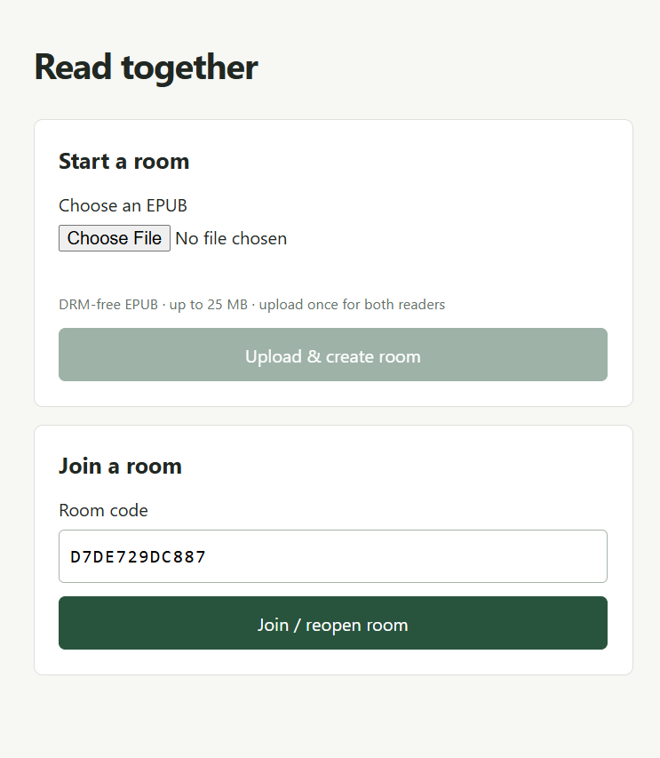
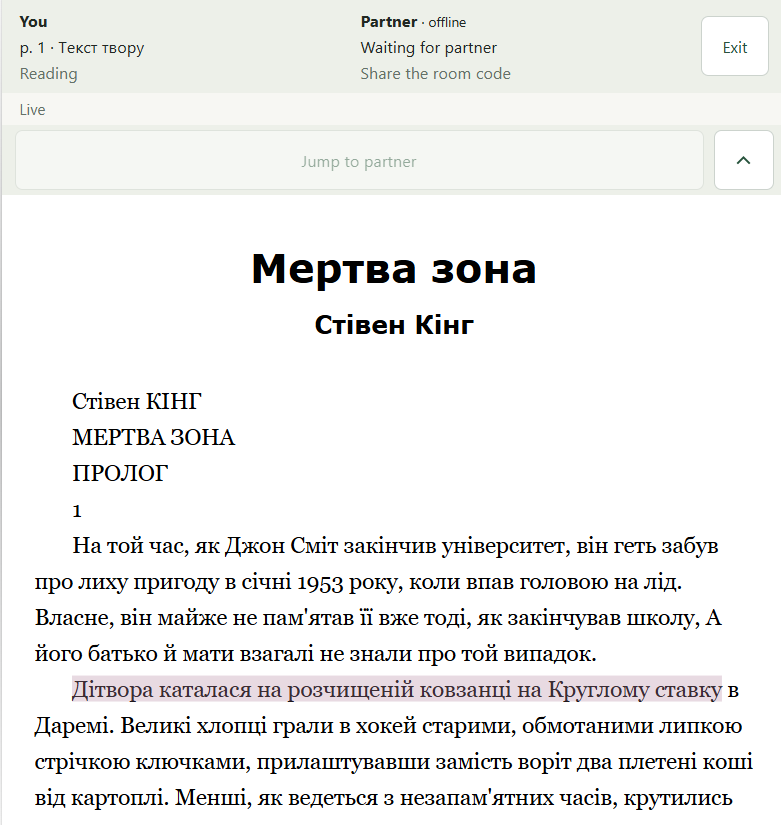

# Read together

A small web app for two people reading the same EPUB. Read at your own pace, see where your partner is, and leave highlights with optional comments. No accounts or sign-in.

[Open the app](https://read-together-delta.vercel.app/)

## Features

- Upload one DRM-free EPUB (up to 25 MB) and invite a second reader with a room code.
- Read independently, see your partner's position live, or jump to their exact place.
- Mark your current position as **Done here**.
- Highlight text with an optional comment. Each reader has a consistent, distinct color.
- Collapse the top panel for more reading space and resume from the same browser later.
- Listen to the current page using your own ElevenLabs key, with voice selection and native audio controls.

Designed for mobile screens, including Android and iOS. No library, chat, PDF support, or profiles.

## Screenshots

### Create or join a room



### Read together



Screenshots show the interface; no EPUB files are included in the repository.

## Architecture

| Choice | Reason |
| --- | --- |
| **Next.js + TypeScript** | One application serves the UI and API routes. Backend secrets stay on the server. |
| **epub.js** | Renders books in the browser and provides EPUB CFI positions: pointers into text that work across different screen sizes. |
| **Supabase Realtime Presence** | Shares current position and status without a database write on every page turn. Browser storage handles resume; there is no server-side reading history. |
| **One room table** | Holds two browser seats and shared highlights. Version-checked updates prevent simultaneous highlight saves from overwriting each other. |
| **Private Supabase Storage** | Upload the book once; admitted readers get temporary signed download URLs. |
| **Browser tokens instead of accounts** | A random token identifies each seat; the server stores its hash. Simple to join, but clearing browser storage loses that seat. |

The browser calls Next.js API routes to create/join rooms and save highlights. RLS protects room data from direct browser database access. Realtime channels use unguessable names shared only with the admitted readers; these are public channels with secret names, not authenticated private channels.

This architecture is intended for **two trusted people**, not an unrestricted public file-sharing service. A third browser cannot join an occupied room, even if both readers are offline.

Failed Presence updates reconnect with exponential backoff and a single pending retry. **Live** returns only after the latest position has been published successfully.

## Run locally

Requires **Node.js 24** and a Supabase project.

1. Install dependencies with `npm ci`.
2. Run [supabase/setup.sql](supabase/setup.sql) in the Supabase SQL editor. It creates the room table, grants, and private EPUB bucket. Allow public Realtime channels; no Postgres replication publication is needed.
3. Copy [.env.example](.env.example) to `.env.local` and fill in:

   ```dotenv
   NEXT_PUBLIC_SUPABASE_URL=https://YOUR_PROJECT.supabase.co
   NEXT_PUBLIC_SUPABASE_PUBLISHABLE_KEY=YOUR_PUBLISHABLE_KEY
   SUPABASE_SECRET_KEY=YOUR_SERVER_SECRET_KEY
   ```

   Keep the secret key server-only. Environment files are ignored by Git.
4. Run `npm run dev` and open [localhost:3000](http://localhost:3000).

Create a room, then enter its code in another browser. After exiting the reader, the last room code remains in the home page's join field.

For Docker-based Supabase setup and detailed behavior, see [the setup guide](docs/setup-and-behavior.md).

## Deploy

Import this repository into Vercel as a Next.js project. Add all three environment variables **before building**, then deploy. Public variables are embedded in the browser bundle during the build. Use HTTPS when sharing with phones.

## Listen to a page

1. Open a book and tap the headphones button.
2. Enter an [ElevenLabs API key](https://elevenlabs.io/app/settings/api-keys) with **Text to Speech** and **Voices read** permissions. Set a spending limit in ElevenLabs.
3. Load voices, choose one, and select **Generate page audio**. Then press Play; the native player supports pause and seeking on mobile.

The key and selected voice stay in memory until you exit or reload the reader. **Forget key** clears them immediately. No new environment variable, account system, or database migration is needed.

Only text between the visible page's start and end CFI is sent through a room-authorized server route to ElevenLabs. Generation uses [Multilingual v2](https://elevenlabs.io/docs/overview/models), returns MP3, and consumes your ElevenLabs credits. The provider's own data-retention terms apply. The app does not store the key, text, or audio in its database or logs. Responses are not cached; replay within the open audio window does not generate again.

Closing the audio window stops playback and cancels pending requests; cancellation cannot guarantee a refund for generation already started by ElevenLabs. The page snapshot stays fixed while settings are open so the phone keyboard does not change the text being read. Close the window before turning pages. Text-free pages and pages above 10,000 characters show an error rather than silently skipping or truncating text. No automatic page turning or background audio guarantee.

## Checks

```sh
npm run typecheck
npm run test:presence
node --test checks/elevenlabs.test.mjs
npm run build
npx playwright install chromium webkit
npm test
```

Browser tests need a configured Supabase backend and create rooms/uploads, so use a development project. They cover two-reader sync, private book access, highlights, reconnects, and third-reader rejection. Test EPUBs are generated from original fixture text.

Tests have passed with mobile Chromium and WebKit emulation. Physical Android and iOS devices have not been verified.

Audio browser tests use a playable fixture response; provider tests check request forwarding, error sanitization, limits, and cancellation with mocked fetch. They do not validate ElevenLabs voice quality or consume real credits.

## Current limits

- One active tab per reader is expected. Clearing browser storage does not free its permanent seat.
- Saving highlights requires a connection. There is no full offline book-download feature.
- Rooms and books remain until manually removed; there is no automatic cleanup.
- DRM-protected EPUBs and PDFs are unsupported. Large illustrated or fixed-layout books may behave differently.

## Code map

- `src/app/page.tsx` — upload and join screen
- `src/components/Reader.tsx` — EPUB reader and controls
- `src/lib/presence-connection.ts` — connection lifecycle and retries
- `src/lib/use-room.ts` — live positions and local resume
- `src/lib/use-highlights.ts` — shared highlights and comments
- `src/app/api/rooms/` — room admission, book access, and highlight API
- `supabase/setup.sql` — database and storage setup
