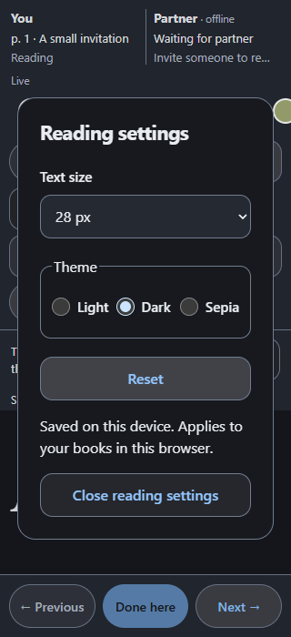
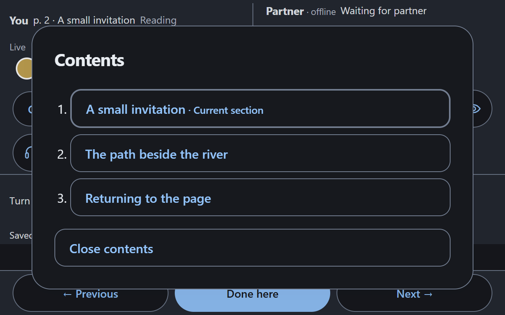

# Phase 2A–2B validation

Contents and personal reading appearance are integrated into `develop`. Physical Safari/iPhone acceptance remains open in BLA-26 and BLA-23. This work does not authorize a production release.

## Delivery evidence

| Package | Final feature head | PR / develop merge | Hosted checks and integration |
| --- | --- | --- | --- |
| BLA-24, Contents | `0435191` | [PR #11](https://github.com/myverp/read-together/pull/11), `58d353d` | [PR run](https://github.com/myverp/read-together/actions/runs/37315615493), [push run](https://github.com/myverp/read-together/actions/runs/37315606330) passed |
| BLA-25, settings | `2be304e` | [PR #12](https://github.com/myverp/read-together/pull/12), `516affa` | [PR run](https://github.com/myverp/read-together/actions/runs/37379290255), [push run](https://github.com/myverp/read-together/actions/runs/37379282766) passed |

Contents commits: `19c4cb2`, `aac9e5a`, `2b84bf8`, `0435191`. Settings commits: `1819a9e`, `7435b99`, `23f860e`, `2ddb320`, `c9453f2`, `be6fce3`, `2be304e`. Acceptance tests and documentation are delivered in a separate PR; its final results are recorded below when verified.

## Environment and coverage

Local checks used Windows, Node.js 24, Next.js 16.3.4 and epub.js 0.3.93. API, database, Auth, Storage, maintenance and browser checks used only disposable `read-together-ci`, Supabase CLI 2.114.0, ports 57320–57324 and a production-mode local application built with `build:ci`. The normal development database and hosted/production backend were not used. Preview success is recorded separately and is not backend isolation evidence. CI runs on Linux with disposable Supabase and Chromium/WebKit mobile emulation.

BLA-24 passed 39 unit tests, 8 isolated API/database/Storage checks and 54 browser cases. BLA-25 passed 42 unit tests, build/TypeScript, 8 isolated API/database/Storage checks and 62 Chromium/WebKit cases. The final hosted jobs passed those checks before merge.

The tests verify nested EPUB 3 and EPUB 2 NCX, spine fallback, plain-text long labels, rejected external/unsafe/missing destinations, fragment CFI, current-section indication, repeated navigation, delayed/late relocation, timeout/retry and Exit/reopen. Appearance tests cover 16/18/28 px, all themes, Reset, personal preferences across books and independent contexts, malformed/blocked storage, preserved text CFI/Done, rotation/reopen/refresh, author colors/sizes, headings/emphasis, code/tables, unchanged SVG colors and explicitly disabled fixed-layout sizing. Ordinary text/status/link/error palette pairs meet 4.5:1 contrast on both reader surfaces.

Acceptance extends existing annotation/audio scenarios rather than duplicating them: drafts block Contents/Settings, saved highlight/comment and drawing payloads remain unchanged after Dark/28 px, the drawing's original snapshot stays white, and the partner stays in Light. Listen after reflow uses the visible-page text; changing settings alone sends no provider request. Swipe cases check both dialogs block gestures and navigation works after reflow, across sections and after reopening; native Chromium touch delivery is also exercised. CDP native touch injection is Chromium-only, so its WebKit counterpart is explicitly skipped; synthetic touch-event behavior is tested in both engines.

Previous progress/takeover/offline/pending, invitations, hostile EPUB and two-reader scenarios remain in the bounded CI suite. No schema, dependency, provider configuration or production change is included.

## Visual and keyboard inspection

The local isolated demo and fixture books were inspected at 320, 390, 768 and 1280 CSS px, with 28 px text and Light/Dark/Sepia. Controls wrap without horizontal overflow; Contents remains readable at 320 px, and collapsed details retain Exit. Dialogs scroll, Escape closes them and focus returns after any pending reflow. Two useful screenshots are retained:

Native **Chrome for Testing → Settings → Appearance → Page zoom = 200%** was checked on 2026-10-05 (Europe/Berlin). A 1280×800 window became a 640×400 CSS viewport with devicePixelRatio 2; there was no horizontal overflow. Contents was readable; settings allowed scrolling to Close, and both Close and Escape returned focus to their respective triggers. Zoom was restored to 100% after the check. This is real browser zoom on the desktop browser, not a physical iPhone check. Earlier root-font enlargement and a reduced viewport were supplementary emulation only.

## Findings resolved during verification

Theme content hooks in epub.js run after the manager's initial display. A first font reflow could preserve the stored CFI while showing the wrong screen. The reader now restores that text anchor again after theme geometry settles, before accepting relocation. A pending resize also required delayed dialog focus restoration and Exit to wait for active navigation; those regression scenarios passed.

Hosted Linux WebKit returned zero IntersectionObserver visibility for a paragraph fragmented across CSS columns, while failure screenshots showed the target's first word on-screen. The assertion now checks a short text Range against the clipped reader viewport, retaining the requirement that the target text actually be visible. The product positioning fix remains in place. Failed hosted runs were investigated; no automatic rerun, weakened assertion or extended timeout was used to mask an unknown failure.

## Physical Safari/iPhone acceptance — pending

No physical-device result is available for this phase. Earlier phase acceptance does not verify these new controls. Record date, iPhone model, iOS/Safari version, test environment/backend and whether the result was observed directly or reported by the owner. Do not use production data for this acceptance; use an HTTPS application connected only to the disposable test backend.

1. Open a DRM-free EPUB, use Contents to visit a section and an internal fragment; confirm the expected text. Exit and reopen at that text.
2. Set 28 px, try Light/Dark/Sepia, rotate both ways, switch apps and return to Safari. Confirm the same text anchor, usable Exit and readable controls. Reset should restore Light/18 px.
3. Save a highlight/comment and a drawing. Change font/theme, reopen, and confirm both anchors and the drawing's original snapshot. An unsaved draft must block Contents/Settings.
4. Verify a swipe after closing each dialog and an explicit Listen after reflow. No audio request should occur merely from changing appearance.
5. With a second independent reader, confirm personal appearance and position remain independent; Jump to partner is explicit.

Until this result is supplied, BLA-26/BLA-23 remain open even after the technical acceptance PR is merged. Real ElevenLabs voice quality, physical device speech/audio decoding and general EPUB compatibility beyond the tested fixtures remain outside automated proof; Windows WebKit's native PCM decoder limitation is annotated in the existing audio test.
